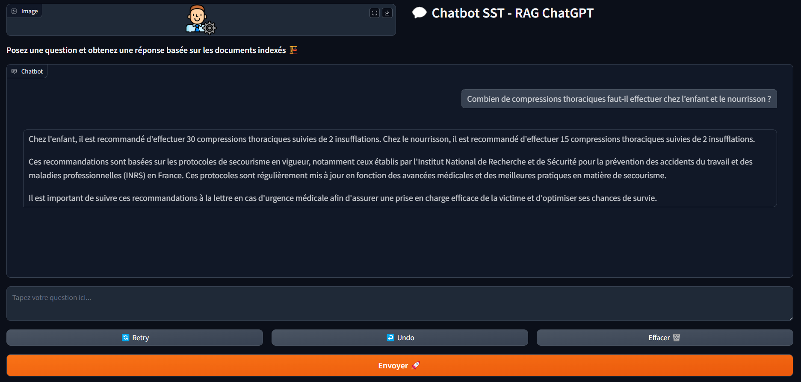

# RAG-LLM_for_SST — AI Assistant for Occupational First Aid (SST)
An experimental LLM rag for french SST (First aid) using a hybrid rietriver

This project implements a **Retrieval-Augmented Generation (RAG)** pipeline tailored for **Occupational Health and Safety (Sauveteur Secouriste du Travail - SST)**. It combines hybrid document retrieval (semantic + lexical) and answer generation using **OpenAI’s GPT-4**.

---

##  Features

- **PDF Ingestion & Chunking**: Extract and preprocess data from SST training materials.
- **Hybrid Retrieval**: Combine FAISS + MiniLM embeddings with BM25 keyword matching.
- **OpenAI Integration**: Query LLM with contextually retrieved documents.
- **FastAPI API**: Lightweight backend for programmatic access.
- **Gradio UI**: User-friendly web interface for question-answering.

---

## Retrieval Strategy

This project uses **hybrid retrieval** to improve the relevance of retrieved information before it is passed to the language model.

### Semantic Search (FAISS + MiniLM)
- Uses the transformer model `all-MiniLM-L6-v2` from SentenceTransformers to embed documents and queries.
- FAISS enables efficient vector similarity search.
- Captures conceptual meaning, even when vocabulary varies.

### Lexical Search (BM25)
- Uses the `rank_bm25` algorithm.
- Retrieves passages with exact or partial keyword overlap.
- Very useful for domain-specific terminology.

### Hybrid Scoring
- Results from both FAISS and BM25 are normalized.
- Final score = `alpha * semantic_score + (1 - alpha) * lexical_score`
- This fusion ensures robustness and recall.

## RAG Methodology

### 1. Document Ingestion
- Load and parse PDFs with PyMuPDF.
- Clean up text and extract sections/subsections/pages.

### 2. Chunking Strategy
- Chunking is based on sentence breaks (`. `) and detection of section headers (e.g. `1.`, `1.1`).
- Each chunk is enriched with page, section, subsection, and document name.

### 3. Embedding & Indexing
- Embedding using SentenceTransformers (`MiniLM`).
- Normalization with `sklearn.preprocessing.normalize`.
- Storage using FAISS (cosine similarity).

### 4. Lexical Indexing
- Tokenization with `nltk.word_tokenize`.
- Scoring with `rank_bm25.BM25Okapi`.

### 5. Hybrid Retrieval
- Query runs against both FAISS and BM25.
- Scores are normalized and combined with a weighting parameter `alpha`.

### 6. Prompt Building
- Prompt constructed with retrieved context + user question.
- Follows an instructional format: `Context`, `Question`, `Answer`.

### 7. LLM Querying
- Query sent to OpenAI (e.g. GPT-4-turbo).
- Controlled temperature and formatting.

### 8. Response Display
- Displayed in API response or Gradio UI.
- Optionally highlighted keywords.

---

##  Project Structure

```
├── config/
│   ├── .env
│   └── config.yaml
├── data/
│   ├── raw/                # Original PDFs
│   ├── processed/          # Cleaned and chunked text
│   └── logs/               # Optional logs
├── docs/                  
├── models/
│   ├── embeddings/         # Downloaded sentence-transformer models
│   └── index/
│       └── index_files/    # FAISS index and metadata_passages.json
├── src/
│   ├── api/                # FastAPI and ChatGPT interface
│   ├── data_processing/    # PDF parsing and cleaning
│   ├── model_management/   # FAISS, BM25, hybrid retrieval
│   └── ui/                 # Gradio interface
├── environment.yml
├── requirements.txt
├── hybrid_run_project.py   # Main pipeline runner (from scratch)
├── hybrid_run_LLM.py       # Lightweight runner (requires preprocessed data)
└── README.md
```
            
---

## Installation

### 1. Clone the repository

```bash
git clone https://github.com/valentinb67/RAG-LLM_for_SST.git
cd RAG-LLM-SST
```

### 2. Create and activate the environment

### Using Conda
```bash
conda env create -f environment.yml
conda activate rag_llm_sst
```
### Using Pip
```bash
pip install -r requirements.txt
```

### 3. Set up your OpenAI API Key

```ini
OPENAI_API_KEY=sk-...
OPENAI_MODEL=gpt-4
```

# Running the Project

## Run the full pipeline (PDF → Embeddings → API + UI)

```bash
python hybrid_run_project.py
```

## Run only the API and UI (requires precomputed embeddings/index)

```bash
python hybrid_run_LLM.py
```
## Execution Flow

When running `python hybrid_run_project.py`, the following sequence occurs:

- **Step 1: PDF Extraction**
  - `src/data_processing/hybrid_data_process.py`
  - Extracts and chunks text from raw PDFs.
  - Outputs cleaned JSON passages.

- **Step 2: Build FAISS Index**
  - `src/model_management/hybrid_vector_store.py`
  - Embeds text with MiniLM and builds a FAISS index.
  - Saves both index and BM25 token data.

- **Step 3: Hybrid Retrieval Test**
  - `src/model_management/hybrid_retrieval.py`
  - Loads index and metadata.
  - Performs a test retrieval to verify indexing.

- **Step 4: Launch API**
  - `src/api/api.py`
  - Starts FastAPI at `http://127.0.0.1:8000`.
  - Accepts POST requests to query the LLM.

- **Step 5: Launch Gradio UI**
  - `src/ui/ui.py`
  - Opens a local interface for user interaction.
---

## API Endpoints

GET / — Welcome message

POST /query — Ask an SST-related question
Example request:




## About creation and Data sources : 

This project was carried out with the goal of applying theory to practice and was developed in collaboration with a French INRS-SST trainer [INRS – French SST - Technical Guide for First Aid (2024)](https://www.inrs.fr). Ultimately, the project is intended to be used for educational purposes as part of training programs.
